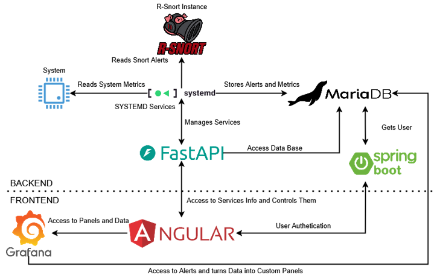

# R-Snort

The architecture of R-Snort is modular, distributed, and scalable, designed to adapt to SOHO environments. The system consists of two main elements: the Snort agents—deployed on embedded systems like the Raspberry Pi—and a central module that facilitates comprehensive coordination, management, and monitoring.

Each Snort agent operates as an autonomous sensor, based on a customized version of Snort 3 to optimize performance on the limited hardware of embedded systems like the Raspberry Pi. These agents use a custom Snort installation compiled from its source code, incorporating various libraries for proper functioning, such as libdnet, libdaq, LuaJIT, Flex, Bison, and PCRE2 (figure 1). This allows for efficient and stable system execution on the Raspberry Pi platform.

Threat detection is based on a dual approach: official community rules and custom rules specifically developed to identify sensitive data (e.g., credentials or bank cards), thereby compensating for the absence of the old "Sensitive Data" preprocessor, which has been discontinued in Snort 3. Additionally, the implemented system uses various preprocessors like HTTP Inspect, SSL Inspector, Stream IP, Stream TCP, and Reputation, which provide an exhaustive inspection of traffic to detect evasion techniques and encrypted threats. Furthermore, they incorporate the ClamAV antivirus module, which complements Snort, providing an additional layer of security against malware through signature-based analysis.




The R-Snort architecture is structured into three independent modules that simplify the process:
•	rsnort-installer: Completely installs Snort 3, including its dependencies, preprocessor configuration, and the activation of advanced detection rules.
•	snort-agent: Installs a monitoring agent, integrating essential services such as MariaDB, Grafana, metrics collection, log rotation, and a REST API for system interaction.
•	rsnort-central-module: Installs the administration interface, which includes the Spring Boot backend and the Angular frontend. This central module centralizes the management of all system agents through an intuitive web interface.


## Credits

Authors: Deian Orlando Petrovics Tabacu,  Dr. Julio Gómez López and Dr. Nicolás Padilla Soriano
Final Degree Project Advisor: Dr. D. Julio Gómez López and Dr. Nicolás Padilla Soriano - University of Almería, 2025


---
## Contact
**Deian Orlando Petrovics T.**


```
## License
This project is released under the MIT License. See [LICENSE](https://choosealicense.com/licenses/mit/) for details.
